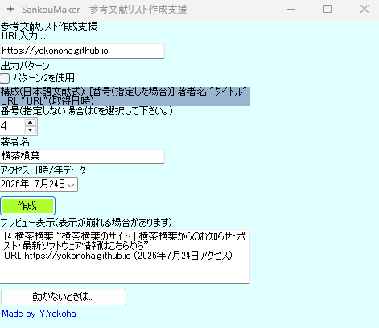

# sankou_maker
参考文献リスト作成支援ソフト - 自動で体裁を整えてクリップボード出力! 執筆のお供になる(かもしれない)便利ツール  
URLを挿入し、パラメータをいじるだけで簡単!  
プレゼン資料の最終ページや論文の後ろに貼り付けるだけでOK!  
卒業論文の執筆に忙しい学生さんにもおススメ!(ソフトウェアの利活用の可否に関しては各教育機関の指示に従ってください。)  

### 出力例  
- パターン1(基本タイプ)

[1]Y.Yokoha “横茶横葉のサイト | 横茶横葉からのお知らせ・ポスト・最新ソフトウェア情報はこちらから”    
URL https://yokonoha.github.io (2026年7月24日アクセス)  
- パターン2(外国語文献向け)

[1]Y.Yokoha.(2026).“YOKOSTA | Y.Yokoha Studio Site”  
https://yokonoha.github.io/yokosta  

### 免責事項  
当ソフトウェアにて作成した文献明示文の記載方法は場合によっては不適当な場合もございます。そのため、ご利用の際は自己責任でご利用ください。  
当ソフトウェアを利用したことで発生したすべての事象・損害に対して製作者は利用規約に定める通り、一切の責任を負いかねます。  
当ソフトウェアをご利用いただいた時点で"横茶横葉のサイト コンテンツ利用規約"にどうしたものとみなします。[コンテンツ利用規約はこちらです。](https://yokonoha.github.io) 
当ソフトウェアは動的サーバーには対応しておりません。そのため、タイトルデータが取得できない場合はSankouMaker 2をご利用ください。  
また、SankouMaker 2は現在公開準備中です。ReCaffeineという別ソフトと連動して動作する仕様のため、ReCaffeineの公開までしばらくお待ちください。  
